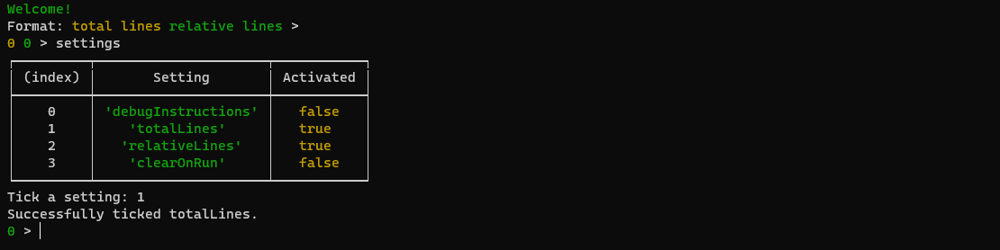

# Cheat Sheet for Terminal Interface
A cheat sheet for all custom commands in [Terminal Interface](terminal-interface.js)

Sometimes you want to run mlog in the terminal pretty easily, but unfortunately it takes this cheat sheet to do that. This cheat sheet will list **all custom commands\*** in the Terminal Interface.

\*easter-egg commands will probably come later

Here is the list of almost all custom commands, with description, with examples, ranked by importance.

* `run`

   Runs the last mlog commands since the last `run` related execution.
   
   Example:
   
   
* `run-limit`

   Same as `run`, but with a limit of how many mlog operations it can run. Prevents infinite loops.
   
   Example:
   
   
* `run-all`

   Same as run, but instead of the last execution, it re-runs all mlog commands from the start.

   Example:
   
   
* `exit`

   This is how you exit the session without <kbd>Ctrl+C</kbd>ing.

   Example:
   
   
* `clear`

   Clears the console.
   
   If you want to clear the console after executing a `run`-related command, go to `settings`.
   
   No example provided.
* `settings`

   Shows all display settings. These include:
   
   * total lines number
   * relative lines number (lines since the last `run` related command)
   * debug instructions (shows all tokens when doing any `run` related command)

   Example:
   
   
* `full code`

  Displays the full code from the start. This is what `run-all` executes.

  Example:
  
  
* `edit line`

  Edits lines within the full code.

  Example:
  
  
* `blackhole`

  A new start. **Removes almost all data saved.**

  Example:
  
  
* `check printB`

  Displays what's in the print buffer.

  Example:
  
  
